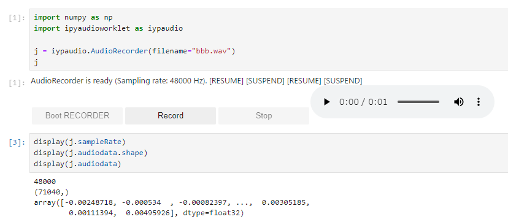

# ipyaudioworklet

<!--
[](https://travis-ci.org/naoh16/ipyaudioworklet)
[](https://codecov.io/gh/naoh16/ipyaudioworklet)
-->

A Jupyter Widget for Web Audio Recording using Audio Worklet

This extension will be enable us to record PCM audio using AudioWorkletNode of Web Audio API.
For the security constraints of major web-browsers, you need to run JupyterLab with HTTPS context.



## Installation

You can install using `pip`:

### Prebuild

```bash
pip install -U ipyaudioworklet
```

or, you may find some prebuilt packages in GitHub releases. Eg.

```bash
pip install -U https://github.com/naoh16/ipyaudioworklet/releases/download/v0.1.3/ipyaudioworklet-0.1.3-py3-none-any.whl
```

### Self-build from master branch

```bash
pip install git+https://github.com/naoh16/ipyaudioworklet.git
```

## Usage

### quickstart

- You can see the interface as following cell:

  ```python
  import ipyaudioworklet as ipyaudio
  
  recorder = ipyaudio.AudioRecorder()
  recorder
  ```

- Then you can find three buttons in the widget.

  - `[Boot RECORDER]` Button / `recorder.run()`
    -  As first, you need to push the button to boot up the recorder.
    -  Please allow your web browser access to your PC's microphone.
  - `[Record]` Button / `recorder.resume()`
    - You can record audio.
  - `[Stop]` Button / `recorder.suspend()`
    - You can stop the recording.
  - audio control (HTML5's ``<audio>``)
    - You can preview the recroded sound.
    - You may download the sound as WAV file through option menu of the control. (depend on your web browser)

### Examples

See examples: [examples/introduction.ipynb](examples/introduction.ipynb)

You can try them on Binder:
[](https://mybinder.org/v2/gh/naoh16/ipyaudioworklet/main?labpath=examples)


## For developers and Audio/Sound reserchers!!

Please check the following files. They are the core modules of this extension.

- JupyterLab/ipywidgets interface
  - [src/widgets.ts](src/widgets.ts) ... Frontend of the widget
  - [ipyaudioworklet/audio.py](ipyaudioworklet/audio.py) ... Backend of the widget
- Audio Recording
  - [src/audio.ts](src/audio.ts) ... Utility functions using Web Audio API
  - [src/_static/audio-processor.js](src/_static/audio-processor.js) ... AudioWorkletNode definition. This node is ping pong the recording audio fragments to the callback function defined in `audio.ts`.

---

TODO: The following lines are not modified from cookie-cutter templates.

### Miscs

If you are using Jupyter Notebook 5.2 or earlier, you may also need to enable
the nbextension:
```bash
jupyter nbextension enable --py [--sys-prefix|--user|--system] ipyaudioworklet
```

## Development Installation

Create a dev environment:
```bash
conda create -n ipyaudioworklet-dev -c conda-forge nodejs yarn python jupyterlab
conda activate ipyaudioworklet-dev
```

Install the python. This will also build the TS package.
```bash
pip install -e ".[test, examples]"
```

When developing your extensions, you need to manually enable your extensions with the
notebook / lab frontend. For lab, this is done by the command:

```
jupyter labextension develop --overwrite .
yarn run build
```

For classic notebook, you need to run:

```
jupyter nbextension install --sys-prefix --symlink --overwrite --py ipyaudioworklet
jupyter nbextension enable --sys-prefix --py ipyaudioworklet
```

Note that the `--symlink` flag doesn't work on Windows, so you will here have to run
the `install` command every time that you rebuild your extension. For certain installations
you might also need another flag instead of `--sys-prefix`, but we won't cover the meaning
of those flags here.

### How to see your changes
#### Typescript:
If you use JupyterLab to develop then you can watch the source directory and run JupyterLab at the same time in different
terminals to watch for changes in the extension's source and automatically rebuild the widget.

```bash
# Watch the source directory in one terminal, automatically rebuilding when needed
yarn run watch
# Run JupyterLab in another terminal
jupyter lab
```

After a change wait for the build to finish and then refresh your browser and the changes should take effect.

#### Python:
If you make a change to the python code then you will need to restart the notebook kernel to have it take effect.

## Updating the version

To update the version, install tbump and use it to bump the version.
By default it will also create a tag.

```bash
pip install tbump
tbump <new-version>
```

## Build sdist and wheel

```bash
hatch build
```

## Publish public repository and CDNs

### PyPI

```bash
pip install twine
twine upload --repository testpypi dist/ipyaudioworklet-<new-version>*whl
twine upload --repository pypi dist/ipyaudioworklet-<new-version>*whl
```

### NPM

```bash
npm publish --access public
```
